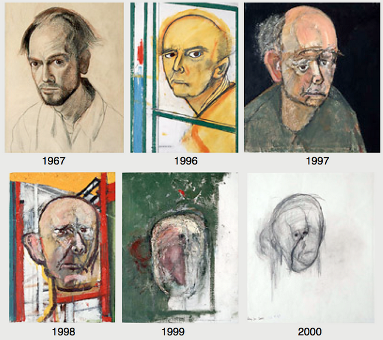

# 2024-1-P1-dementia

  

## Resumo
Esse repositório contém o estudo dos dados de demência em um dataset opensource com a informação de 1000 pessoas e 24 features. O trabalho é constituido do tratamento, processamento e exploração dos dados, incluindo modelos de ML e seus resultados.
