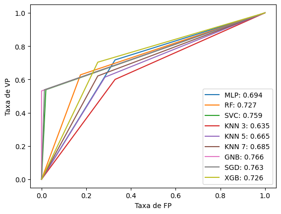
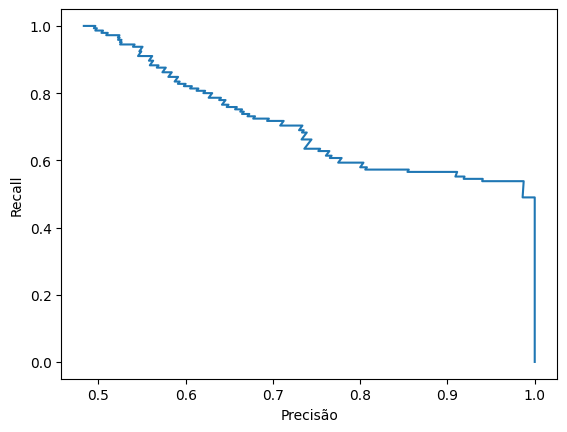

# 2024-1-P1-dementia


<p align="center">
  
</p>


## Resumo
Esse repositório contém o estudo dos dados de demência em um dataset opensource com a informação de 1000 pessoas e 24 features. O trabalho é constituido do tratamento, processamento e exploração dos dados, incluindo modelos de ML e seus resultados.


## Sumário

- [Resumo](#resumo)
- [Sumário](#sumário)
- [Base de dados](#base-de-dados)
- [Instalação](#instalação)
- [Como usar](#como-usar)
- [Resultados](#resultados)
- [Licença](#licença)

## Base de dados

A base de dados está disponibilizada na plataforma Kaggle sobre as diretrizes da licença apache 2.0. Os dados foram levantados por meio de webscraping, consulta em dados open source e no sistema nacional de saúde britânico(NHS). Os dados englobam 1000 pessoas não identificadas entre 60 e 90 anos, com múltiplas informações relevantes. Os dados ao todo são 23 colunas e mais uma coluna com o diagnóstico de demência ou não (0 ou 1), esses dados são balanceados quanto a presença da doença e outros fatores como sexo, mão dominante e escolaridade.


| Atrbiuto                   | Descrição                                                                                                                                                        | Variável/Tipo                 |
| :---                       |     :---                                                                                                                                                         | :---                          |
| Diabetic                   | Sofre de diabetes?                                                                                                                                               | Sim (1) ou não(0)             |
| Alcohol Level              | Quantidade de alcool no sangue.                                                                                                                                  | Valor contínuo                |
| Heart Rate                 | Batimentos cardiacos por minuto.                                                                                                                                 | Valor inteiro                 |
| Blood Oxygen Level         | Taxa de oxigenação do sangue.                                                                                                                                    | Valor contínuo                |
| Body Temperature           | Temperatura medida.                                                                                                                                              | Valor contínuo                |
| Weight                     | Peso.                                                                                                                                                            | Valor contínuo                |
| MRI Delay                  | Tempo que demorou para o médico pedir uma ressonância magnética.                                                                                                 | Valor contínuo                |
| Prescription               | Qual remédio o paciente toma.                                                                                                                                    | Classes (5)                   |
| Dosage in mg               | Dose do remédio.                                                                                                                                                 | Valor inteiro                 |
| Age                        | Idade.                                                                                                                                                           | Valor inteiro                 |
| Education_Level            | Grau de educação do paciente.                                                                                                                                    | Classes (4)                   |
| Dominant_Hand              | Qual a mão dominante.                                                                                                                                            | destro (1) ou canhoto(0)      |
| Gender                     | Genêro.                                                                                                                                                          | masculino (1) ou feminino(0)  |
| Family_History             | Histórico de demência na família.                                                                                                                                | Sim (1) ou não(0)             |
| Smoking_Status             | Relação do paciente com o cigarro.                                                                                                                               | Classes (3)                   |
| APOE_ε4                    | Presença de variação no alelo 4 do gene APOE.                                                                                                                    | Sim (1) ou não(0)             |
| Physical_Activity          | Prática de atividade física.                                                                                                                                     | Classes (3)                   |
| Depression_Status          | O paciente possui depressão?                                                                                                                                     | Sim (1) ou não(0)             |
| Cognitive_Test_Scores      | Nota no teste cognitivo.                                                                                                                                         | Valor inteiro                 |
| Medication_History         | Possui histórico de medicação?                                                                                                                                   | Sim (1) ou não(0)             |
| Nutrition_Diet             | Tipo da dieta.                                                                                                                                                   | Classes (3)                   |
| Sleep_Quality              | Qualidade do sono.                                                                                                                                               | boa (1) ou ruim(0)            |
| Chronic_Health_Conditions  | Possui problemas cronicos de saúde?                                                                                                                              | Classes (4)                   |
| Dementia                   | Possui demência?                                                                                                                                                 | Sim (1) ou não(0)             |

## Instalação

### Ambiente virtual

O pacote `conda` é necessário para criar ambientes virtuais Python. Para instalá-lo siga as instruções disponibilizadas na [Documentação](https://docs.conda.io/projects/conda/en/latest/user-guide/install/index.html).

### Obtendo o projeto

Agora, vamos clonar um repositório Git e criar um ambiente virtual Python:

```bash
# Baixe o projeto
git clone https://github.com/intel-comp-saude-ufes/2024-1-P1-dementia.git

# Entre na pasta do projeto
cd 2024-1-P1-dementia/

# Crie um ambiente virtual com nome 'dementia'
conda create -n dementia

# Ative o ambiente virtual
conda activate dementia
```

### Instalando as dependências

Uma vez no ambiente virtual, instale as dependências do projeto:

```bash
conda install pip jupyterlab
pip install -r requirements.txt
```

## Como usar

Para abrir os Jupyter Notebooks que contém o projeto, basta utilizar o projeto [JupyterLab computational environment](https://github.com/jupyterlab/jupyterlab) (já consta como dependência desse trabalho). Para executá-lo, basta digitar no terminal: 

```bash
jupyter-lab
```

Então, abra o browser em: [http://localhost:8888/](http://localhost:8888/). O arquivo [notebooks/project](./notebooks/project.ipynb) que contém todo o código desenvoldido do projeto.

## Resultados 

|Curva ROC                  |  Curva PRC XGBoost            |
|:-------------------------:|:-------------------------:
  |  

Nesse trabalho foram verificadas algumas informações interessantes quanto a demência e aos dados utilizados. Primeiramente as análises permitiram confirmar a relação tanto do tabagismo quanto da baixa escolaridade como fatores de risco para o desenvolvimento de demência e também se teve que a influência da mão dominante no desenvolvimento de demência não foi estatisticamente relevante. 

Os resultados mostram que os classificadores utilizados tiveram bons resultados e teriam boa aplicabilidade para um modelo em produção. Entretanto, o algoritmo *Extreme Gradient Boosting* superou em desempenho quando comparado aos outros (melhor média harmônica F1). Dessa forma, poderia-se utilizar um sistema de alerta que avalie dados médicos básicos e aponte possíveis candidatos a desenvolver demência.

## Licença

Este projeto é licenciado sob os termos da [licença MIT](./LICENSE) e está disponível gratuitamente.
