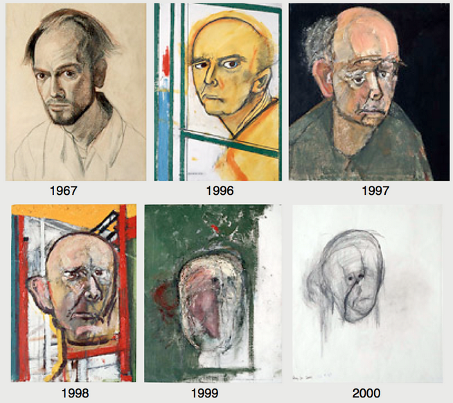

# 2024-1-P1-dementia

  

## Resumo
Esse repositório contém o estudo dos dados de demência em um dataset opensource com a informação de 1000 pessoas e 24 features. O trabalho é constituido do tratamento, processamento e exploração dos dados, incluindo modelos de ML e seus resultados.

## Sumário

- [Resumo](#resumo)
- [Sumário](#sumário)
- [Base de dados](#base-de-dados)
- [Instalação](#instalação)
- [Como usar](#como-usar)
- [Resultados](#resultados)
- [Licença](#licença)

## Base de dados

a base de dados disponibilizada na plataforma Kaggle sobre as diretrizes da licença apache 2.0. Os dados foram levantados por meio de webscraping, consulta em dados open source e no sistema nacional de saúde britânico(NHS). Os dados englobam 1000 pessoas não identificadas entre 60 e 90 anos, com múltiplas informações relevantes. Os dados ao todo são 23 colunas e mais uma coluna com o diagnóstico de demência ou não (0 ou 1), esses dados são balanceados quanto a presença da doença e outros fatores como sexo, mão dominante e escolaridade.

| Atrbiuto                   | Descrição                                                                                                                                                        | Variável/Tipo                 |
| :---                       |     :---                                                                                                                                                         | :---                          |
| Diabetic                   | Sofre de diabetes?                                                                                                                                               | Sim (1) ou não(0)             |
| Alcohol Level              | Quantidade de alcool no sangue.                                                                                                                                  | Sim (1) ou não(0)             |
| Heart Rate                 | Batimentos cardiacos por minuto.                                                                                                                                 | Sim (1) ou não(0)             |
| Blood Oxygen Level         | Taxa de oxigenação do sangue.                                                                                                                                    | Sim (1) ou não(0)             |
| Body Temperature           | Temperatura medida.                                                                                                                                              | Número inteiro                |
| Weight                     | Peso.                                                                                                                                                            | Sim (1) ou não(0)             |
| MRI Delay                  | Tempo que demorou para o médico pedir uma ressonância magnética.                                                                                                 | Sim (1) ou não(0)             |
| Prescription               | Qual remédio o paciente toma.                                                                                                                                    | Sim (1) ou não(0)             |
| Dosage in mg               | Dose do remédio.                                                                                                                                                 | Sim (1) ou não(0)             |
| Age                        | Idade.                                                                                                                                                           | Sim (1) ou não(0)             |
| Education_Level            | Grau de educação do paciente.                                                                                                                                    | Sim (1) ou não(0)             |
| Dominant_Hand              | Qual a mão dominante.                                                                                                                                            | Sim (1) ou não(0)             |
| Gender                     | Genêro.                                                                                                                                                          | Sim (1) ou não(0)             |
| Family_History             | Histórico de demência na família.                                                                                                                                | Sim (1) ou não(0)             |
| Smoking_Status             | Relação do paciente com o cigarro.                                                                                                                               | Escala de 1 à 5               |
| APOE_ε4                    | Presença de variação no alelo 4 do gene APOE.                                                                                                                    | Escala de 0 à 30              |
| Physical_Activity          | Prática de atividade física.                                                                                                                                     | Escala de 0 à 30              |
| Depression_Status          | O paciente possui depressão?                                                                                                                                     | Sim (1) ou não(0)             |
| Cognitive_Test_Scores      | Nota no teste cognitivo.                                                                                                                                         | Feminino (0) ou masculino (1) |
| Medication_History         | Possui histórico de medicação?                                                                                                                                   | Escala de 0 à 14             |
| Nutrition_Diet             | Tipo da dieta.                                                                                                                                                   | Escala de 1 à 6               |
| Sleep_Quality              | Qualidade do sono.                                                                                                                                               | Escala de 1 à 8               |
| Chronic_Health_Conditions  | Possui problemas cronicos de saúde?                                                                                                                              | Escala de 1 à 8               |
| Dementia                   | Possui demência?                                                                                                                                                 | Escala de 1 à 8               |

## Instalação

## Como usar

## Resultados 

## Licença
